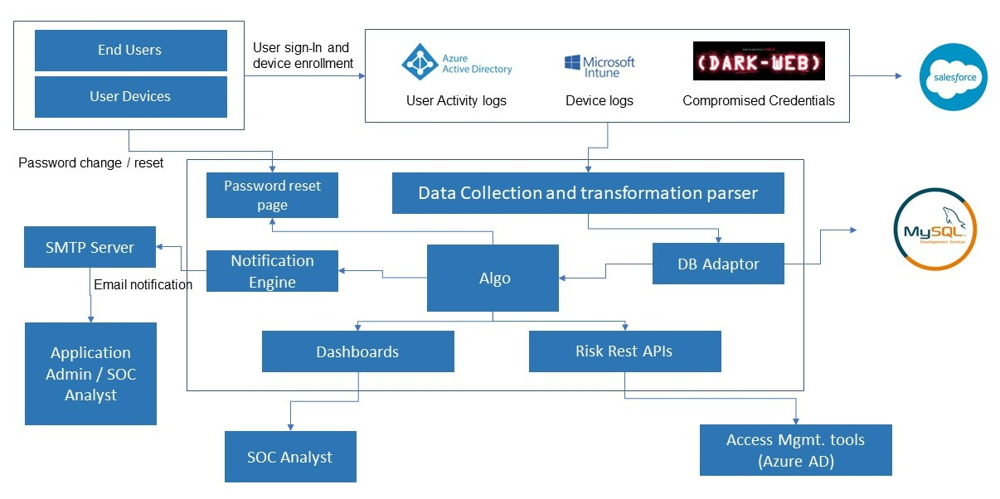

# Defending Against Identity Threats Using Adaptive Authentication

## What Are Identities?
Identities encompass all entities, both human and machine, that can access resources within an organization's ecosystem. They include IT admins, employees, third-party vendors, devices, and applications. In today's remote-working era, identities play a pivotal role in safeguarding critical systems and data.

## What Are Identity-Based Attacks?
Identity-based attacks exploit vulnerabilities in authentication and access control mechanisms. Threat actors target user credentials, devices, or privileged accounts to infiltrate systems, escalate privileges, and launch attacks. Common examples include phishing, credential stuffing, session hijacking, and attacks targeting weak or static authentication systems.

## About Our Project
Our project, **Defending Against Identity Threats Using Adaptive Authentication**, addresses these challenges by implementing a dynamic and intelligent risk-based authentication system. It uses zero-trust principles and a risk-scoring algorithm to classify users and devices as "risky" or "non-risky." By analyzing behavioral and contextual data, the system dynamically adapts authentication requirements to mitigate potential threats.

The project specifically tackles five real-time use cases and devises risk-scoring algorithms for each, providing a robust defense against identity-based attacks.

---

## Key Features
- **Dynamic Risk-Based Authentication**: Moves beyond static username-password methods to a context-aware, adaptive approach.
- **Anomaly Detection**: Identifies and flags suspicious behaviors or access patterns.
- **Zero-Trust Principles**: Assumes no entity is inherently safe and continuously validates users and devices.
- **Device Health Posture**: Considers devices as identities and evaluates their safety.
- **SOC Dashboard**: Provides SOC analysts with a clear interface to view and manage risk scores.

---

## Use Cases
The project focuses on five real-time use cases that address different identity-based threats:

1. **Impossible Travel**:
   - Detects logins from geographically impossible locations within a short time frame.
   - Calculates travel velocity to flag abnormal login attempts.
   - Risky users are prompted for Multi-Factor Authentication (MFA) in subsequent logins.

2. **Anonymity Sign-In**:
   - Flags logins from anonymous browsers, such as TOR, where device details are hidden.
   - Increases the device risk score and triggers mitigative actions like MFA.

3. **Atypical User Sign-In Behavior**:
   - Detects deviations in login patterns based on:
     - **Location**: Flags logins from unusual geographic locations.
     - **Browser**: Identifies logins from new or unrecognized browsers.
     - **Device**: Highlights logins from unfamiliar devices.
   - Risk scores are updated based on these anomalies, and appropriate actions are taken.

4. **Compromised Credentials**:
   - Prevents logins with credentials found to be compromised.
   - Redirects users to reset their passwords, ensuring account security.

5. **Unsafe Device Login**:
   - Flags logins from non-compliant or unregistered devices.
   - Increases the risk score and enforces mitigative measures.

---

## Technology Stack
- **Frontend**: HTML5, JavaScript, JQuery.
- **Backend**: Java Spring Boot, Maven.
- **Database**: MySQL.
- **APIs**: Microsoft Graph API for integration with Azure AD.
- **Development Tools**: Eclipse IDE, Apache Tomcat.

---

## Project Design
### System Architecture

The above diagram illustrates the high-level architecture of the system, showcasing the integration of various components like Azure AD, risk scoring, and dashboard visualization.

---

## How to Use
1. **Prerequisites**:
   - Install Java JDK 8 or higher, Maven, MySQL, and a compatible web browser.
   - Set up Azure Active Directory for integration.
2. **Setup Instructions**:
   - Clone the repository: `git clone <repository-link>`.
   - Configure the database and application server in the `application.properties` file.
   - Deploy the WAR file on Apache Tomcat.
   - Access the application via `http://<server-address>:<port>`.

---

## Future Scope
The project demonstrates the potential of risk-based authentication in a subset of real-time use cases. In the future:
- Additional real-time use cases can be incorporated to enhance the system's coverage.
- Identities such as service applications can be included alongside user and device identities.
- More sophisticated access control decisions and mitigation actions can be implemented, such as varying levels of restrictions or automated incident response.
- Device safety assessments can be extended to consider malware presence, operating system compliance, and other factors.

---

## Contributors
- **Lalitha Sravanti Dasu**
- **Mannav Dhamija**
- **Gurram Dishitha**
- **Ajith Vivekanandan**

---

For a detailed explanation of the project, refer to the uploaded **project report** in this repository. Additionally, the journal publication on this project is available in the **website section** of the repository.
